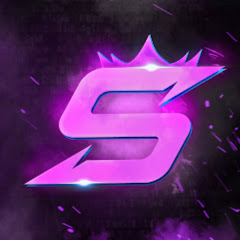
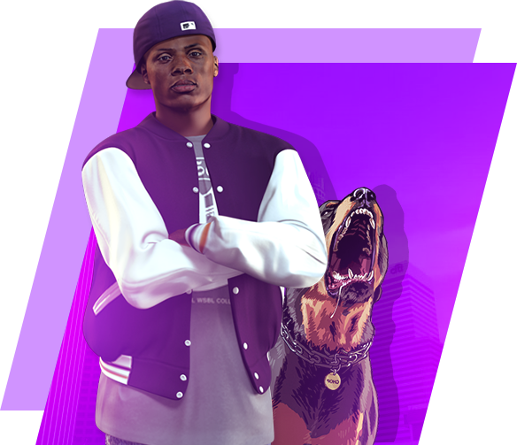
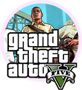
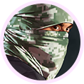
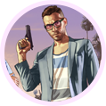
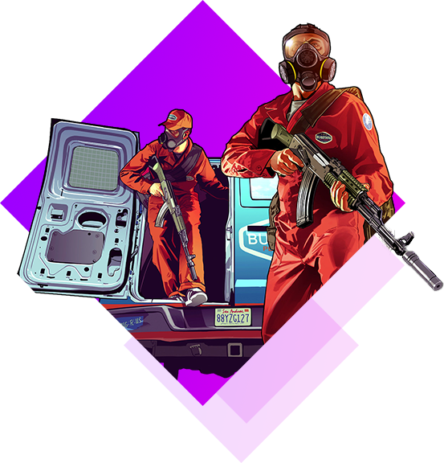

# SGL-rp.am
<!DOCTYPE html>
<html lang="en">
<head>
<meta charset="UTF-8">
<meta name="viewport" content="width=device-width, initial-scale=1.0">
<meta http-equiv="X-UA-Compatible" content="ie=edge">
<link rel="stylesheet" href="all.css" integrity="sha384-oS3vJWv+0UjzBfQzYUhtDYW+Pj2yciDJxpsK1OYPAYjqT085Qq/1cq5FLXAZQ7Ay" crossorigin="anonymous">
<link rel="stylesheet" href="bootstrap.min.css" integrity="sha384-GJzZqFGwb1QTTN6wy59ffF1BuGJpLSa9DkKMp0DgiMDm4iYMj70gZWKYbI706tWS" crossorigin="anonymous">
<link rel="stylesheet" href="main.css">
<link rel="stylesheet" href="media.css">
<link rel="stylesheet" href="bootstrap.css">
<link rel="icon" type="image/png" sizes="32x32" href="unnamed.jpg">
<title> Գլխավոր- SGL RP</title>
</head>
<body>
<header>

<a href="#" class="mobile_nav">

</a>
<ul class="nav_menu">
<a href><li>Գլխավոր</li></a>
<a href="index (1).html"><li>Ֆորում</li></a>
<a href="http://files.sa-mp.com/sa-mp-0.3.7-install.exe"><li>սկսել խաղալ</li></a>
<a href="https://discord.gg/d5ghNhD3"><li>Դիսկորդ</li></a>
<a href><li>Դոնատ</li></a>
<a href><li class="social"><i class="fab fa-vk"></i></li></a>
</ul>

</header>
<section class="header">

SGL RolePlay это - 

Նոր պրոեկտ   SGL RP 

<ul class="buttons_list">
<a href class="btn_link">
<li>սկսել խաղալ</li>
</a>
<a href class="btn_link">
<li>Փոխանցել գումար</li>
</a>
</ul>

</section>
<section class="how_to_play">

Ինչպես սկսել խաղալ ?

    Ներբեռնել   SGL RP լիցենզյան

    Այն թույլ է տալիս ներբեռնել խաղը

<a href="http://files.sa-mp.com/sa-mp-0.3.7-install.exe" class="step_btn"> Ներբեռնել</a>

    ԲԵՌՆԻՐ ԵՎ   ՏԵՂԱԴՐԻՐ
    MULTIPLAYER

    Multiplayer թույլ է տալիս Ձեզ միացնել մի շարք
    խաղացողների ամբողջ աշխարհում

<a href="http://files.sa-mp.com/sa-mp-0.3.7-install.exe" class="step_btn">Ներբեռնել MULTIPLAYER</a>

    ՍԿՍԵԼ ԽԱՂԸ    SGL Role Play

    ՍԿՍԵԼ ԽԱՂԸ
    Միացրու Multiplayer-ը
    Անվան տեղում մուտքագրեք Ձեր մականունը
    Սեխմեք  և ավելացրեք
    մեր սերվերը Ձեր Էջում։

<a href="#" class="step_btn"> ՍԿՍԵԼ ԽԱՂԸ</a>

</section>
<section class="news">

    Նոր   պրոեկտ 

<a href class="link_vk">Մեր Vkontakt</a>

Читать

    Նորությունների վերնագիր
    տող երկրորդ լուրերի վերնագիր
    տող երկու

Читать

    Նորությունների վերնագիր
    տող երկրորդ լուրերի վերնագիր
    տող երկու

Читать

    Նորությունների վերնագիր
    տող երկրորդ լուրերի վերնագիր
    տող երկու

Читать

    Նորությունների վերնագիր
    տող երկրորդ լուրերի վերնագիր
    տող երկու

<a href="#" class="moore_link">տեսնել բոլորը</a>

</section>
<section class="why_we">

    Ինչու են բոլորը ընտրում   SGL RP

    Այս Խաղը տարբերվում է մյուս Project-ներից իր դիզայնով խաղի մոդով և նաև փոփոխված են ավտոմեքենաների դիզայնը

<ul class="why_list">
<li>

    հետաքրքիր   խաղ!

</li>
<li>

    Կանոնավոր  թարմացումներ 

</li>
<li>

    Ժամանակակից  խաղի ռեժիմ

</li>
</ul>

</section>
<section class="social_block">

Մեր Vkontakt

SGL Role Play

    Պաշտոնական կայք

<a href="https://vk.com/id785725619" class="btn_group">Բաժանորդագրվել</a>

SGL Role Play

    Պաշտոնական կայք

<a href="https://vk.com/id785725619" class="btn_group">Բաժանորդագրվել</a>

</section>
<footer>

© 2023 SGL RP

<ul class="social_links">
<li><a href="#"><i class="fab fa-youtube"></i></a></li>
<li><a href="#"><i class="fab fa-vk"></i></a></li>
<li><a href="#"><i class="fab fa-discord"></i></a></li>
</ul>

<ul class="list_menu col-lg-9 col-md-9">
<li> <a href="#">Օգտվելու կանոններ</a> </li>
<li> <a href="#">Հրաժարում պատասխանատվությունից</a> </li>
<li> <a href="#">Պաշտպանության քաղաքականություն</a> </li>
</ul>

    © all right | Reserved

</footer>

</body>
</html>
